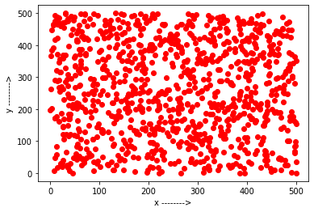
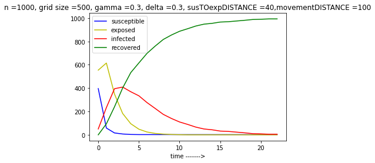
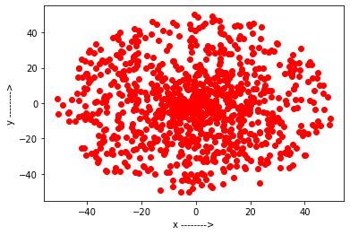

# Covid-SNA
Project involves: 

1- Mathematical modeling of the spread of a pandemic in a population considering the case of SEIR Model (Suspectible-Exposed-Infected-Recovered) over a contact network. 

2- Creating of the Monte Carlo simulation of the mathematical model for numerical analysis. 

3- Creating a web demo of the spread of pandemic in a network using HTML, CSS and JavaScript. 

Project Members:
Vaibhav Mishra | Muzzafer Ali | Abhinav Pandey | Kunal Jangid

Project Duration : 1 October,2020 - 1 Nov,2020.

Checklist:

1- Mathematical Model - Completed

2- Monte Carlo Simulation-  Completed

3- Web Demonstration - Completed

**Project Instructions:**
1.To understand the mathematics, refer to the mathematical-model.pdf.
2. The simulation is done on two graphs, first graph is a random contact network graph based on SEIR Model, the simulation for which can be found at plots_random.ipynb. 
2. The simulation for the second graph can be found at plots-gaussian.ipynb where a gaussian graph is used to create a contact network and plots are plotted.
3. the simulation is done using monte carlo and the code is written in python.
4. A web interface is designed for visualizing the progress of spread of pandemic in a contact network written in CSS, HTML anf JavaScript present in simulation folder.

**Simulation for SEIR Model on Contact Network

**Graph Plot of the simulation

**Simulation for gaussian distribution of Contact Network

**Graph plot for the simulation
